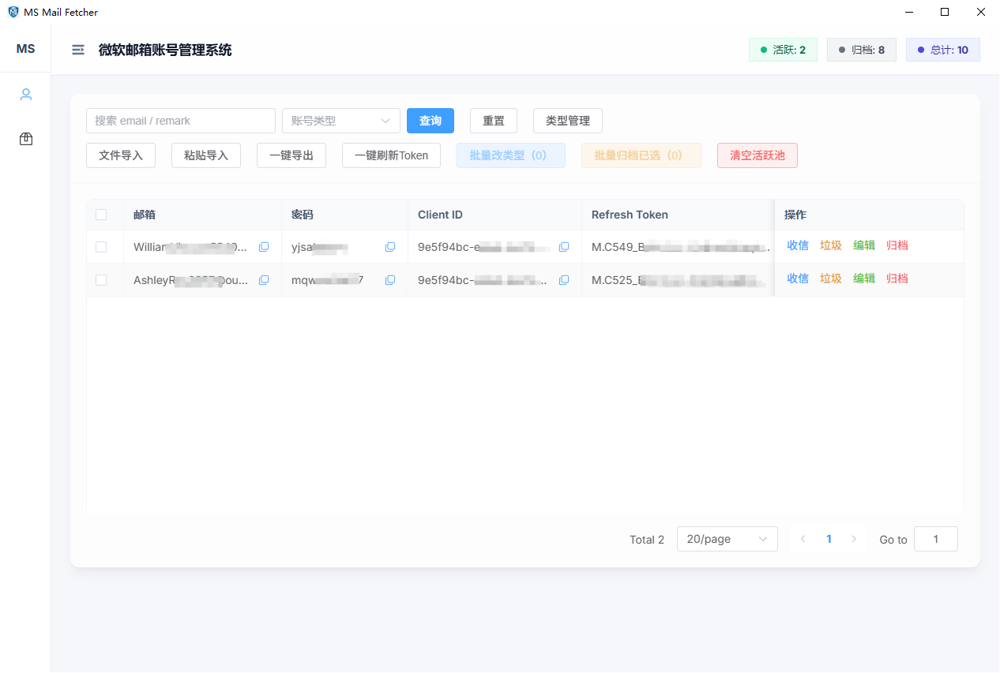
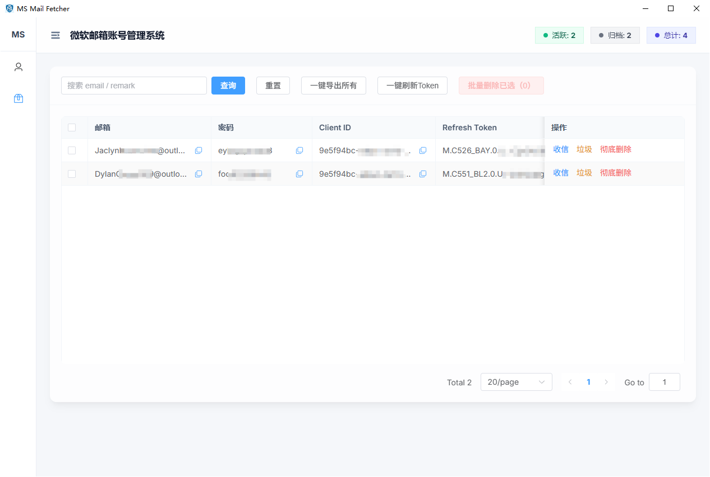
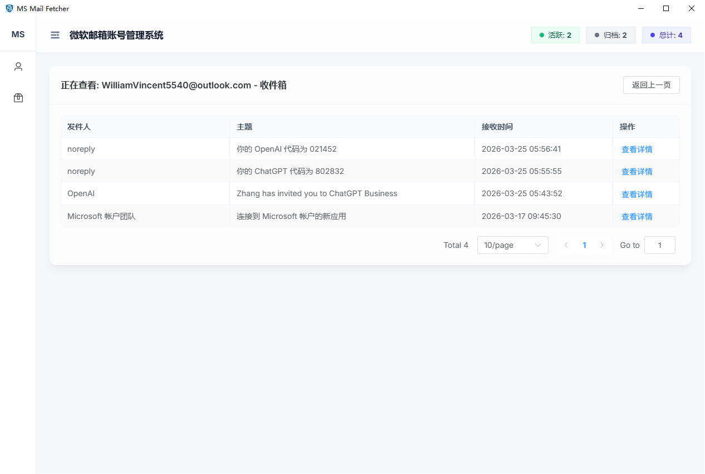
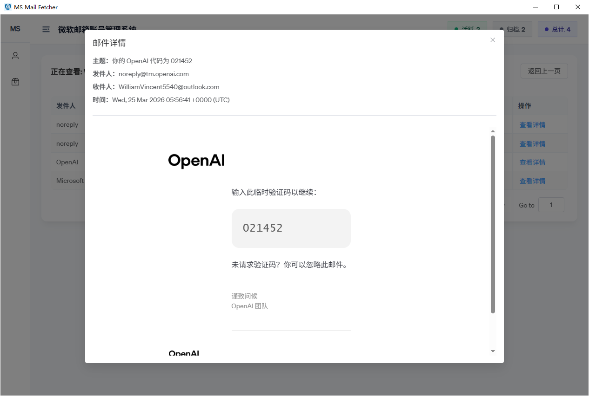

# MS Mail Fetcher

一个基于 **FastAPI + Vue 3 + pywebview** 的Outlook邮件账号管理与邮件查看工具，支持：

- Web 前后端分离开发
- 桌面版（Windows）一键打包分发
- SQLite 本地持久化存储
- 账号分组、归档、批量操作、邮件读取

---

## 界面展示








## 1. 项目结构

```text
ms-mail-fetcher/
├─ build_desktop.bat                 # Windows 一键构建（前端构建 + 桌面打包）
├─ ms-mail-fetcher-server/           # 后端 + 桌面启动入口
│  ├─ app.py                         # 后端 API 启动入口（Uvicorn）
│  ├─ desktop_main.py                # 桌面版启动入口（pywebview + 内置 API）
│  ├─ server.config.json             # 运行端口配置
│  ├─ ms-mail-fetcher-desktop.spec   # PyInstaller 打包配置
│  ├─ requirements.txt               # Python 依赖
│  ├─ app/                           # FastAPI 业务代码
│  ├─ template/                      # 前端构建产物目录（供后端静态托管）
│  └─ docs/sqlite-schema.md          # SQLite 表结构说明
└─ ms-mail-fetcher-web/              # Vue 3 + Vite 前端
   ├─ src/
   ├─ package.json
   └─ vite.config.js
```

---

## 2. 技术栈

### 后端
- Python 3.10+
- FastAPI
- Uvicorn
- SQLAlchemy
- Pydantic
- Requests

### 前端
- Vue 3
- Vite
- Element Plus
- Axios
- Vue Router

### 桌面化
- pywebview
- PyInstaller

---

## 3. 环境要求

### 必需环境
- Python 3.10+
- Node.js 20+
- npm 10+

### 推荐（Windows 桌面打包）
- Windows 10/11
- 已安装 WebView2 Runtime

---

## 4. 快速开始（开发模式）

### 4.1 启动后端 API

在 `ms-mail-fetcher-server` 目录：

```bash
pip install -r requirements.txt
python app.py
```

默认读取 `ms-mail-fetcher-server/server.config.json`，并自动处理端口占用（若开启回退）。

### 4.2 启动前端开发服务器

在 `ms-mail-fetcher-web` 目录：

```bash
npm install
npm run dev
```

---

## 5. 桌面版运行与打包（Windows）

### 5.1 本地运行桌面版（开发验证）

在 `ms-mail-fetcher-server` 目录：

```bash
python desktop_main.py
```

行为：
- 启动内置 FastAPI 服务（`127.0.0.1` 可用端口）
- 打开 pywebview 窗口

### 5.2 一键构建桌面包（推荐）

在仓库根目录：

```bash
build_desktop.bat
```

脚本流程：
1. 构建前端 `ms-mail-fetcher-web/dist`
2. 将前端构建产物同步到 `ms-mail-fetcher-server/template`
3. 清理旧 `dist`
4. 执行 `pyinstaller --clean ms-mail-fetcher-desktop.spec`

产物：
- `ms-mail-fetcher-server/dist/ms-mail-fetcher/ms-mail-fetcher.exe`

---

## 6. 运行配置

配置文件：`ms-mail-fetcher-server/server.config.json`

示例：

```json
{
  "host": "0.0.0.0",
  "port": 18765,
  "reload": false,
  "auto_port_fallback": true,
  "port_retry_count": 20
}
```

字段说明：
- `host`：绑定地址
- `port`：首选端口
- `reload`：开发热重载（仅开发时）
- `auto_port_fallback`：端口被占用时自动递增尝试
- `port_retry_count`：尝试端口数量

---

## 7. 数据库与数据存储

应用使用 SQLite，数据库文件默认位于：

- Windows: `%LOCALAPPDATA%/ms-mail-fetcher/ms_mail_fetcher.db`
- 无 `LOCALAPPDATA` 时：`~/.ms-mail-fetcher/ms_mail_fetcher.db`

主要数据表：
- `accounts`
- `account_types`

详细结构参考：`ms-mail-fetcher-server/docs/sqlite-schema.md`

---

## 8. 主要 API 路由（后端）

- 健康检查：`GET /api/health`
- 账号管理：`/api/accounts`
  - 列表、创建、更新、删除
  - 批量归档、导入、导出、批量刷新 token
- 账号类型：`/api/account-types`
  - 列表、创建、更新、删除
- 邮件读取：`/api/accounts/{account_id}/mail/{folder}`
- UI 偏好：`/api/ui/preferences`

---

## 9. Git 忽略建议

仓库根目录维护 `.gitignore`，建议忽略：

- `.vscode/`
- `ms-mail-fetcher-server/build/`
- `ms-mail-fetcher-server/dist/`
- `ms-mail-fetcher-web/node_modules/`
- `ms-mail-fetcher-web/dist/`
- `__pycache__/`
- `*.db`
- `.env*`（保留示例文件）

---

## 10. 常见问题

### Q1：前端页面空白/404
请先执行前端构建，并确认 `ms-mail-fetcher-server/template/index.html` 存在。

### Q2：端口被占用
检查 `server.config.json` 中是否开启 `auto_port_fallback`，或手动修改 `port`。

### Q3：桌面包无法覆盖旧版本
先关闭正在运行的 `ms-mail-fetcher.exe`，再重新执行 `build_desktop.bat`。

### Q4：能否打包 mac 版本？
可以，但建议在 macOS 环境中执行打包（通常不建议在 Windows 直接跨平台产出 `.app`）。

---

## 11. 维护建议

- 每次发布前执行一次完整桌面构建验证
- 定期备份 SQLite 文件
- 对敏感配置使用环境变量或本地私有配置文件

---

## 12. License

如需开源发布，请在仓库根目录补充 `LICENSE` 文件并在此处声明许可证类型。


## 13. Link

[Linux do](https://linux.do/) - 学AI，上L站！真诚、友善、团结、专业，共建你我引以为荣之社区。